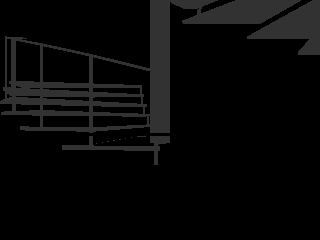

Repository to segment a pointcloud from an image that contains labels.

Can for example be used with Ingition Robotics' IGN Gazebo Segmentation Camera and a LiDAR pointcloud2 and a LiDAR pointcloud2..

